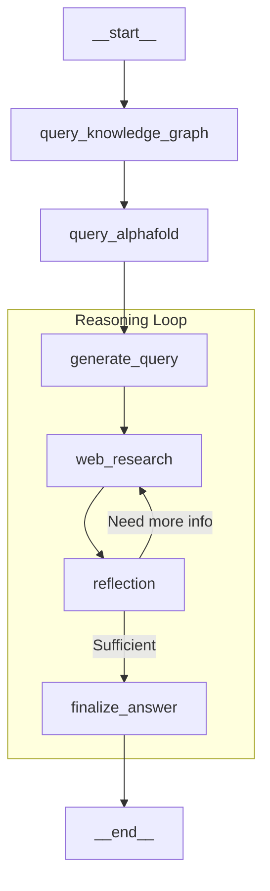

# Sarkome Scientific Agent (Pro-Search)

## 🧬 Architecture & Philosophy
This agent represents a **stateless, scientifically grounded research pipeline**. It is designed to solve the primary challenge of LLMs in biomedicine: **Hallucination**.

By enforcing a strict **"Grounding First"** workflow, we ensure that the Large Language Model acts as a reasoning engine over verified data (PrimeKG, AlphaFold) rather than a generator of plausible-sounding fiction.

### The "Why": Deterministic Grounding -> Probabilistic Reasoning
Most agents start by "thinking" (Planning). We intentionally invert this. We start by **fetching**.
1.  **Deterministic Phase (Grounding):** We query hard databases (Knowledge Graph, AlphaFold) *before* the LLM touches the prompt. This anchors the latent space of the model to reality.
2.  **Probabilistic Phase (Reasoning):** Only after data is gathered do we allow the LLM to reflect, hypothesize, and search the web for recent developments (2025+).

---

## 🏗️ State Graph (`graph.py`)

The agent is implemented using **LangGraph** in a **Stateless** configuration. It does not persist conversation history on the server (no Redis); it relies on the client/frontend to manage the session state if needed, or treats every run as an atomic research task.

### The Pipeline Visualization


### Node Brekadown

#### 1. `query_knowledge_graph` (The Foundation)
*   **Purpose:** Extracts biological entities (Genes, Drugs, Diseases) from the user query and polls the **PrimeKG** database.
*   **Safety:** Uses explicit "Entity Extraction" to map natural language to KG nodes.
*   **Output:** Updates `kg_context` in the state. Does **not** emit chat messages to avoid polluting the UI.

#### 2. `query_alphafold` (The Structure)
*   **Purpose:** Takes genes identified in the KG step and fetches structural data/confidence scores from **AlphaFold DB**.
*   **Logic:** Prioritizes proteins with known variants or structural relevance.
*   **Output:** Updates `alphafold_context`.

#### 3. `web_research` (The Update)
*   **Purpose:** Fetches the absolute latest information (e.g., papers from 2024-2025) that PrimeKG might lack.
*   **Engine:** Uses Google Search via Gemini logical reasoning to synthesize findings.
*   **Output:** Updates `web_research_result`.

#### 4. `reflection` (The Critic)
*   **Purpose:** Evaluates if the combined context (KG + AlphaFold + Web) is sufficient to answer the user's deep scientific query.
*   **Power:** Can reject the current findings and trigger new search queries (Loops).

#### 5. `finalize_answer` (The Synthesis)
*   **Purpose:** The ONLY node authorized to speak to the user.
*   **Mechanism:** Takes the `kg_context`, `alphafold_context`, and `web_research_result` and synthesizes a citation-backed scientific report.
*   **Robustness:** Uses explicit fallbacks (`gemini-2.0-flash-exp`) if model configuration fails.

---

## 🛡️ Technical Robustness (Anti-Fragility)

### 1. Stateless Design
*   **No Checkpointers:** We removed `MemorySaver` and Redis dependencies. This eliminates "Connection Refused" errors and makes the container ephemeral and scalable.
*   **State Reducers:** We use `Annotated[T, replace]` in `state.py` to handle state updates safely without "InvalidUpdateError" conflicts.

### 2. Configuration Fallbacks
*   **Model Safety:** If the Frontend fails to send a model selection (e.g., `gemini-3-pro`), the backend logic in `graph.py` auto-heals using a hardcoded fallback (`gemini-2.0-flash-exp`).
*   **Alias Mapping:** The `Configuration` class automatically maps frontend-specific keys (like `reasoning_model`) to backend-standard keys (`answer_model`).

### 3. Clean Message Handling
*   **No Message Coercion:** Intermediate nodes do not emit `AIMessage` objects. This prevents LangChain from crashing when trying to parse "log payloads" as chat history. Only the final answer renders a message.

---

## 🚀 How to Run
The agent is deployed via Docker with a production-grade Gunicorn server.

```bash
# In the root sarkome_infra
docker-compose up -d --build
```

**Environment Variables Required:**
*   `GEMINI_API_KEY`: For LLM reasoning.
*   `KNOWLEDGE_GRAPH_URL`: Internal URL to the PrimeKG service.
