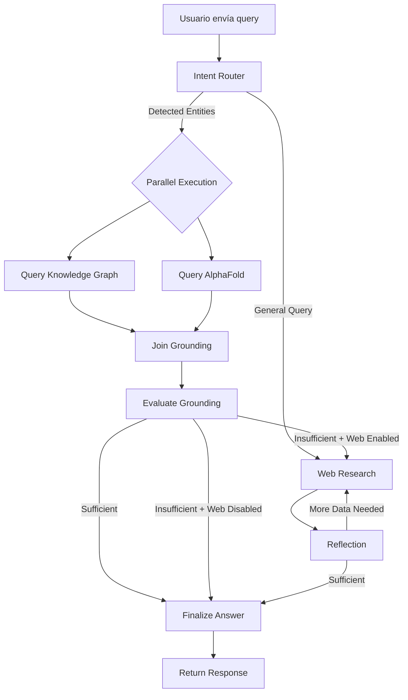

# Sarkome Backend - Agentic System Architecture

**Autor:** Sarkome Team  
**Última actualización:** 2026-01-05  
**Versión:** 2.1.0

---

## Tabla de Contenidos

1. [Visión General](#visión-general)
2. [Arquitectura del Sistema](#arquitectura-del-sistema)
3. [Flujo de Ejecución](#flujo-de-ejecución)
4. [Componentes Principales](#componentes-principales)
5. [Sistema de Configuración](#sistema-de-configuración)
6. [Integración con el Frontend](#integración-con-el-frontend)
7. [Deployment](#deployment)
8. [Desarrollo Local](#desarrollo-local)

---

## Visión General

El backend de Sarkome es un **sistema agéntico de investigación médica** construido sobre **LangGraph**, diseñado para responder consultas científicas complejas mediante la orquestación inteligente de múltiples fuentes de datos:

- **PrimeKG** (Knowledge Graph de biomedicina)
- **AlphaFold Database** (estructuras de proteínas)
- **Google Search API** (investigación web complementaria)

El agente implementa una filosofía **"Grounding First"**: prioriza fuentes canónicas de conocimiento (como grafos de conocimiento) antes de recurrir a búsquedas web, asegurando respuestas precisas y basadas en evidencia científica verificable.

---

## Arquitectura del Sistema

### Stack Tecnológico

```
┌─────────────────────────────────────────────────────────────┐
│                    FRONTEND (React)                         │
│          - Query Builder UI                                 │
│          - Tool Selection (Toggles)                         │
│          - Effort Level Slider                              │
└─────────────────┬───────────────────────────────────────────┘
                  │
                  │ POST /runs/stream { config, input }
                  │
┌─────────────────▼───────────────────────────────────────────┐
│                   BACKEND (FastAPI)                         │
│  ┌──────────────────────────────────────────────────────┐   │
│  │          app.py - API Endpoints                      │   │
│  │   - /runs/stream   (Streaming execution)            │   │
│  │   - /runs/wait     (Synchronous execution)          │   │
│  │   - /api/config/*  (Configuration endpoints)        │   │
│  └──────────────────────────────────────────────────────┘   │
│  ┌──────────────────────────────────────────────────────┐   │
│  │        graph.py - LangGraph Agent Core               │   │
│  │   - Intent Router (Clasificación)                   │   │
│  │   - Parallel Grounding (KG + AlphaFold)             │   │
│  │   - Web Research Loop (Query → Search → Reflect)    │   │
│  │   - Finalize Answer (Síntesis + Citations)          │   │
│  └──────────────────────────────────────────────────────┘   │
└─────────────────┬───────────────────────────────────────────┘
                  │
       ┌──────────┼──────────┐
       │          │          │
       ▼          ▼          ▼
   PrimeKG   AlphaFold   Google
    REST        REST      Search
     API         API        API
```

### Directorio `src/`

```
src/
├── agent/                    # Motor agéntico principal
│   ├── __init__.py
│   ├── app.py               # FastAPI + Endpoints
│   ├── graph.py             # LangGraph: Nodos + Flujo
│   ├── state.py             # Definición de estados (TypedDict)
│   ├── configuration.py     # Sistema de configuración unificado
│   ├── effort_config.py     # Configuraciones por nivel de esfuerzo
│   ├── prompts.py           # Prompts para cada nodo LLM
│   ├── tools_and_schemas.py # Esquemas Pydantic para structured output
│   ├── utils.py             # Utilidades (citas, costos, URLs)
│   └── alphafold.py         # Integración con AlphaFold DB
│
├── knowledge_graph/         # Cliente para PrimeKG
│   └── client.py            # Wrapper REST para el KG
│
└── tools/                   # Herramientas del agente (legacy)
    └── registry.py          # Registro de herramientas disponibles
```

---

## Flujo de Ejecución

### Diagrama de Flujo Simplificado



### Fases del Agente

#### **1. Intent Router** (`intent_router`)
**Propósito:** Análisis inicial del query del usuario.

**Entrada:** 
- Usuario: *"Tratamientos para la adicción a la cocaína"*

**Proceso:**
1. Usa un LLM (Gemini Flash) para clasificar la intención.
2. Extrae entidades biomédicas mencionadas.
3. Decide la estrategia inicial:
   - `general_query`: No hay entidades específicas → Ir a Web Search.
   - `requires_structure`: Requiere estructura 3D de proteínas → KG + AlphaFold.
   - `requires_knowledge`: Solo necesita relaciones canónicas → Solo KG.

**Salida:**
```python
{
  "classification": "requires_knowledge",
  "detected_entities": ["cocaine addiction", "dopamine"],
  "detection_rationale": "User seeks biological relationships..."
}
```

---

#### **2. Parallel Grounding** (KG + AlphaFold)
**Propósito:** Obtener datos canónicos en paralelo para acelerar la investigación.

##### **2a. Query Knowledge Graph** (`query_knowledge_graph`)
- Consulta PrimeKG para cada entidad detectada.
- Recupera relaciones biomédicas (gene-disease, drug-target, etc.).
- Almacena contexto estructurado en `state["kg_context"]`.

##### **2b. Query AlphaFold** (`query_alphafold`)
- Si la query necesita estructuras 3D (`requires_structure`), se ejecuta en paralelo.
- Mapea genes/proteínas a UniProt IDs.
- Recupera datos estructurales de AlphaFold DB.
- Almacena resúmenes en `state["alphafold_context"]`.

##### **2c. Join Grounding** (`join_grounding`)
- Nodo pasivo que sincroniza la ejecución paralela.
- Previene la condición de carrera: asegura que `evaluate_grounding` se ejecute solo UNA VEZ, después de que ambos nodos completen.

---

#### **3. Evaluate Grounding** (`evaluate_grounding`)
**Propósito:** Decidir si los datos canónicos son suficientes para responder la pregunta del usuario.

**Heurística:**
```python
if not kg_context and not alphafold_context:
    return False  # No hay datos, necesitamos web search
    
# Usa LLM para evaluar semánticamente:
# "¿Los datos del KG y AlphaFold responden completamente la pregunta?"
```

**Salida:**
- `grounding_sufficient = True` → Saltar a **Finalize Answer**.
- `grounding_sufficient = False` + `web_search = True` → Continuar a **Web Research**.
- `grounding_sufficient = False` + `web_search = False` → Saltar a **Finalize Answer** con advertencia de datos limitados.

---

#### **4. Web Research Loop**

##### **4a. Generate Query** (`generate_query`)
- Genera N consultas de búsqueda optimizadas para Google Search.
- N depende del `number_of_initial_queries` (configurado por effort level).

##### **4b. Web Research** (`web_research`)
- Ejecuta búsquedas en paralelo usando `google-genai` con la tool `google_search`.
- **Parallel Fan-Out:** Si se generan 3 queries, se lanzan 3 búsquedas simultáneas.
- Extrae snippets, citas y URLs.
- Inserta marcadores de citación en el texto (ej. `[1]`, `[2]`).

##### **4c. Reflection** (`reflection`)
- Evalúa si la información recopilada es suficiente.
- Si NO:
  - Identifica el gap de conocimiento.
  - Genera `follow_up_queries` con la herramienta a usar:
    - `tool: "web_research"` → Buscar más en internet.
    - `tool: "query_knowledge_graph"` → Buscar entidades adicionales en KG.
    - `tool: "query_alphafold"` → Buscar más estructuras.

##### **4d. Evaluate Research** (`evaluate_research`)
- **Decision Point:** ¿Continuar investigando o finalizar?
- Filters:
  - Verifica `max_research_loops` (límite de iteraciones).
  - **Respeta los toggles del frontend:** Si `web_search = False`, no genera más queries web.
  - Selecciona el primer follow-up cuya herramienta esté habilitada.

---

#### **5. Finalize Answer** (`finalize_answer`)
**Propósito:** Síntesis final de todos los datos recolectados.

**Proceso:**
1. Combina:
   - `kg_context`
   - `alphafold_context`
   - `web_research_result` (todos los snippets encontrados)
2. Usa el modelo de razonamiento (Gemini Pro) para generar una respuesta coherente.
3. Inserta citas en el formato final: `[1] → https://source.com`.
4. Calcula el costo total de la ejecución (tokens usados × precio del modelo).

**Salida:**
```python
{
  "messages": [AIMessage(content="...")],
  "sources_gathered": {"[1]": {"url": "...", "title": "..."}},
  "usage_metadata": {"total_cost": 0.0042, "input_tokens": 1200, "output_tokens": 350}
}
```

---

## Componentes Principales

### `state.py` - Gestión de Estado

El estado del agente es **inmutable** y se gestiona mediante `TypedDict` con reducers personalizados:

```python
class OverallState(TypedDict):
    messages: Annotated[list[AnyMessage], add_messages]
    kg_context: NotRequired[Annotated[str, replace]]
    alphafold_context: NotRequired[Annotated[str, replace]]
    web_research_result: NotRequired[Annotated[list[str], operator.add]]
    sources_gathered: NotRequired[Annotated[dict, merge_dicts]]
    usage_metadata: NotRequired[Annotated[dict, sum_usage_stats]]
    # ... más campos
```

**Reducers:**
- `add_messages`: Concatena mensajes (LangChain estándar).
- `replace`: Reemplaza el valor anterior (para strings simples).
- `operator.add`: Concatena listas.
- `merge_dicts`: Merge de diccionarios (para sources).
- `sum_usage_stats`: Acumula costos y tokens.

---

### `configuration.py` - Sistema de Configuración

**Unifica** toda la configuración del agente en una sola clase `Configuration`:

#### Campos Principales

```python
class Configuration(BaseModel):
    # Modelos LLM
    query_model: str = "gemini-3-flash-preview"      # Para búsquedas y routing
    reflection_model: str = "gemini-3-flash-preview" # Para reflexión
    reasoning_model: str = "gemini-3-pro-preview"    # Para respuesta final
    
    # Nivel de Esfuerzo
    effort_level: str = "medium"  # low | medium | high
    recursion_limit: int = 25      # Límite de pasos de LangGraph
    
    # Parámetros de Investigación
    number_of_initial_queries: int = 3
    max_research_loops: int = 2
    
    # Toggles de Herramientas
    web_search: bool = True
    prime_kg: bool = True
    enable_alphafold: bool = True
    
    # APIs Externas
    knowledge_graph_url: str = os.getenv("KNOWLEDGE_GRAPH_URL")
    knowledge_graph_api_key: str = os.getenv("KNOWLEDGE_GRAPH_API_KEY")
```

#### Mapeo de Effort Level a Recursion Limit

El frontend envía `effort_level`, el backend lo traduce:

```python
effort_recursion_limits = {
    "low": 5,      # Respuestas rápidas, investigación mínima
    "medium": 20,  # Balance estándar
    "high": 50     # Investigación exhaustiva
}
```

---

### `graph.py` - Construcción del Grafo

**LangGraph** compila un grafo de estados finitos (FSM) que orquesta la ejecución:

```python
builder = StateGraph(OverallState, config_schema=Configuration)

# Nodos
builder.add_node("intent_router", intent_router)
builder.add_node("query_knowledge_graph", query_knowledge_graph)
builder.add_node("query_alphafold", query_alphafold)
builder.add_node("join_grounding", lambda state: state)  # Sincronización
builder.add_node("evaluate_grounding", evaluate_grounding)
builder.add_node("generate_query", generate_query)
builder.add_node("web_research", web_research)
builder.add_node("reflection", reflection)
builder.add_node("finalize_answer", finalize_answer)

# Flujo
builder.add_edge(START, "intent_router")
builder.add_conditional_edges("intent_router", route_start, [...])
builder.add_edge("query_knowledge_graph", "join_grounding")
builder.add_edge("query_alphafold", "join_grounding")
builder.add_edge("join_grounding", "evaluate_grounding")
builder.add_conditional_edges("evaluate_grounding", route_after_evaluation, [...])
# ... más aristas

graph = builder.compile(name="pro-search-agent")
```

**Aristas Condicionales Clave:**
- `route_start`: Decide si usar KG/AlphaFold o ir directo a web.
- `route_after_evaluation`: Decide si saltar web search basado en toggles.
- `evaluate_research`: Decide si continuar el loop de investigación.

---

## Sistema de Configuración

### Flujo de Configuración (Frontend → Backend)

1. **Frontend UI:**
   ```typescript
   {
     configurable: {
       model_name: "gemini-3-pro-preview",  // Mapea a reasoning_model
       effort_level: "high",
       web_search: true,
       prime_kg: true,
       enable_alphafold: false
     }
   }
   ```

2. **Backend `app.py`:**
   ```python
   config_obj = Configuration.from_runnable_config({"configurable": raw_config})
   # Parsea aliases, mapea effort level, establece recursion_limit
   ```

3. **LangGraph Execution:**
   ```python
   await graph.astream(
       {"messages": messages},
       config={
           "configurable": config_obj.model_dump(),
           "recursion_limit": config_obj.recursion_limit
       }
   )
   ```

### Aliases del Frontend

Para compatibilidad con versiones anteriores del UI:

```python
# Frontend puede enviar:
"model_name" → reasoning_model
"queryModel" → query_model  
"enable_kg" → prime_kg
```

---

## Integración con el Frontend

### Endpoints Principales

#### `POST /runs/stream`
**Streaming de eventos en tiempo real** usando Server-Sent Events (SSE).

**Payload:**
```json
{
  "input": {
    "messages": [
      {"role": "user", "content": "Tratamientos para Alzheimer"}
    ]
  },
  "config": {
    "configurable": {
      "model_name": "gemini-3-pro-preview",
      "effort_level": "medium",
      "web_search": true,
      "prime_kg": true,
      "enable_alphafold": false
    }
  }
}
```

**Respuesta (NDJSON Stream):**
```json
{"intent_router": {"classification": "requires_knowledge", ...}}
{"query_knowledge_graph": {"kg_context": "..."}}
{"finalize_answer": {"messages": [...], "usage_metadata": {...}}}
```

#### `POST /runs/wait`
**Ejecución síncrona** que espera el resultado final.

**Uso:** Testing, validación rápida.

---

### Endpoints de Configuración

- `GET /api/config/models` → Lista de modelos Gemini soportados.
- `GET /api/config/effort-levels` → Configuraciones de esfuerzo disponibles.
- `GET /api/tools` → Herramientas disponibles en el agente.

---

## Deployment

### Infraestructura (GCP)

El backend se despliega en **Google Cloud Run v2** usando Pulumi:

```
┌─────────────────────────────────────────────────────┐
│         Global Load Balancer (HTTPS)                │
│         - IP Estática: lb-ip-address                │
│         - SSL Certificate: api.sarkome.com          │
└──────────────────┬──────────────────────────────────┘
                   │
┌──────────────────▼──────────────────────────────────┐
│           Cloud Run Service                         │
│  - Min Instances: 1   (No cold starts)              │
│  - Max Instances: 10                                │
│  - CPU: 2 vCPU, Memory: 4GB                         │
│  - VPC Connector: Egress PRIVATE_RANGES_ONLY        │
└──────────────────┬──────────────────────────────────┘
                   │
         ┌─────────┼─────────┐
         ▼         ▼         ▼
    Secret     Secret    Secret
   Manager    Manager   Manager
  (Gemini)   (KG API) (LangSmith)
```

**Secrets en Secret Manager:**
- `_GEMINI_API_KEY`
- `_KNOWLEDGE_GRAPH_API_KEY`
- `_KNOWLEDGE_GRAPH_URL`
- `_LANGSMITH_API_KEY`

**Deployment:**
```bash
cd deploy/
pulumi up
```

---

## Desarrollo Local

### Setup Inicial

1. **Crear entorno virtual:**
   ```bash
   python -m venv venv
   .\venv\Scripts\activate  # Windows
   source venv/bin/activate  # macOS/Linux
   ```

2. **Instalar dependencias:**
   ```bash
   pip install -r requirements.txt
   ```

3. **Configurar variables de entorno** (`.env`):
   ```env
   GEMINI_API_KEY=your_key_here
   KNOWLEDGE_GRAPH_URL=https://your-kg-api.com
   KNOWLEDGE_GRAPH_API_KEY=your_kg_key
   EFFORT_LEVEL=medium
   ```

### Ejecutar el Backend

#### Opción 1: Servidor FastAPI (Testing)
```bash
cd src/
uvicorn agent.app:app --reload --port 8080
```

#### Opción 2: LangGraph Studio (Visual Debugging)
```bash
langgraph dev
```
Luego abre: `http://127.0.0.1:2024/studio`

---

### Testing de Endpoints

**Streaming:**
```bash
curl -X POST http://localhost:8080/runs/stream \
  -H "Content-Type: application/json" \
  -d '{
    "input": {"messages": [{"role": "user", "content": "Inhibidores de EGFR"}]},
    "config": {"configurable": {"effort_level": "low", "web_search": false}}
  }'
```

**Sincrónico:**
```bash
curl -X POST http://localhost:8080/runs/wait \
  -H "Content-Type: application/json" \
  -d '{
    "input": {"messages": [{"role": "user", "content": "Proteínas relacionadas con cáncer"}]},
    "config": {"configurable": {"prime_kg": true}}
  }'
```

---

## Logging y Debugging

### Niveles de Log

El sistema usa `logging` de Python con formato estructurado:

```python
import logging
logger = logging.getLogger("sarkome_agent")

logger.info("Routing to Knowledge Graph")
logger.warning("Grounding insufficient but Web Search disabled")
logger.error(f"API call failed: {error}")
```

**Configuración:**
```python
logging.basicConfig(
    level=logging.INFO,
    format='%(asctime)s [%(levelname)s] %(name)s: %(message)s',
    datefmt='%H:%M:%S'
)
```

### LangGraph Studio

Para debugging visual:
1. Inicia el servidor: `langgraph dev`
2. Abre el Studio: `http://127.0.0.1:2024`
3. Visualiza:
   - Cada nodo ejecutado
   - Estado intermedio
   - Decisiones de routing
   - Cost tracking

---

## Troubleshooting

### "API key not valid" (Gemini)
**Causa:** La clave de API no está configurada o es inválida.  
**Solución:**
```bash
# Local
echo "GEMINI_API_KEY=your_key" >> .env

# GCP
gcloud secrets versions add _GEMINI_API_KEY --data-file=key.txt
```

### "Knowledge Graph not configured"
**Causa:** `KNOWLEDGE_GRAPH_URL` o `KNOWLEDGE_GRAPH_API_KEY` faltantes.  
**Solución:** Configura ambas variables en `.env` o Secret Manager.

### "InvalidUpdateError" (LangGraph)
**Causa:** Mutación directa del estado en lugar de retornar diccionarios.  
**Solución:** Asegúrate de que los nodos retornen `dict`, no modifiquen `state` directamente:
```python
# ❌ MAL
def my_node(state):
    state["field"] = "value"  # Mutación directa
    
# ✅ BIEN
def my_node(state):
    return {"field": "value"}  # Retorna actualización
```

### "Unexpected type. Expected 'list'" (Pulumi)
**Causa:** Conflicto de tipos en `ServiceTemplateContainerPortsArgs`.  
**Solución:** Usa un objeto singular, no una lista:
```python
ports=ServiceTemplateContainerPortsArgs(container_port=8080)
```

---

## Referencias

- [LangGraph Documentation](https://langchain-ai.github.io/langgraph/)
- [Google Generative AI SDK](https://ai.google.dev/tutorials/python_quickstart)
- [PrimeKG API Reference](https://primekg.org/)
- [AlphaFold Database](https://alphafold.ebi.ac.uk/)
- [Pulumi GCP Provider](https://www.pulumi.com/registry/packages/gcp/)

---

**Mantenido por:** Sarkome Engineering Team  
**Última revisión:** 2026-01-05
