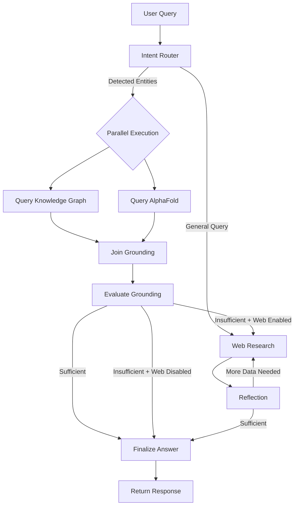

# Agent Reasoning Pipeline

This document provides a deep technical explanation of how Sarkome's AI agents reason over biomedical knowledge to generate therapeutic hypotheses.

The agent is built on **LangGraph**, implementing a sophisticated workflow that combines deterministic **"Grounding First"** principles with iterative **reflection-based** reasoning loops.

---

## Philosophy: Grounding First

Unlike general-purpose AI that may hallucinate medical information, Sarkome follows a strict **"Grounding First"** philosophy:

> **Canonical sources (PrimeKG, AlphaFold) are queried BEFORE web searches, ensuring biological accuracy and verifiable evidence.**

This architecture guarantees:
- **No hallucinated biology**: Every entity and relationship must exist in authoritative databases
- **Explainable reasoning**: Every inference traces back to graph edges or published sources
- **Structured outputs**: Pydantic schemas enforce consistent formatting

---

## Architecture Overview

```
┌─────────────────────────────────────────────────────────────┐
│                    FRONTEND (React)                         │
│          - Query Builder UI                                 │
│          - Tool Toggles (KG, AlphaFold, Web)                │
│          - Effort Level Slider (Low/Medium/High)            │
└─────────────────┬───────────────────────────────────────────┘
                  │ POST /runs/stream { config, input }
                  │
┌─────────────────▼───────────────────────────────────────────┐
│                   BACKEND (FastAPI)                         │
│  ┌──────────────────────────────────────────────────────┐   │
│  │        graph.py - LangGraph Agent Core               │   │
│  │   - Intent Router (Classification)                   │   │
│  │   - Parallel Grounding (KG + AlphaFold)             │   │
│  │   - Web Research Loop (Query → Search → Reflect)    │   │
│  │   - Finalize Answer (Synthesis + Citations)         │   │
│  └──────────────────────────────────────────────────────┘   │
└─────────────────┬───────────────────────────────────────────┘
                  │
       ┌──────────┼──────────┐
       │          │          │
       ▼          ▼          ▼
   PrimeKG   AlphaFold   Google
    REST        REST      Search
     API         API        API
```

---

## Execution Flow

### Simplified State Machine



---

## Phase 1: Intent Router

**Purpose**: Initial analysis of the user's query to determine the optimal research strategy.

### Process

**Model**: Gemini 3.0 Flash (optimized for speed)

1. **Entity Extraction**: Identifies biological entities (genes, proteins, diseases, drugs)
2. **Intent Classification**: Categorizes the query type:
   - `general_query`: No specific entities → Direct to web search
   - `requires_structure`: Needs 3D protein data → KG + AlphaFold
   - `requires_knowledge`: Needs canonical relationships → KG only

### Example

**User Query**: *"What metabolic pathways are disrupted by KRAS G12C mutations?"*

**Output**:
```python
{
  "classification": "requires_knowledge",
  "detected_entities": ["KRAS", "G12C", "metabolic pathways"],
  "detection_rationale": "Query requires canonical gene-pathway relationships"
}
```

**Routing Decision**: Execute parallel grounding (KG + AlphaFold)

---

## Phase 2: Parallel Grounding

**Purpose**: Retrieve canonical data from authoritative sources before web searches.

### 2.1 Knowledge Graph Query

**Tool**: PrimeKG REST API

**Process**:
1. For each detected entity, query the knowledge graph
2. Retrieve:
   - Gene-disease associations
   - Drug-target interactions
   - Protein-protein interactions
   - Pathway memberships
   - Phenotype correlations

**State Update**: `kg_context` (string)

**Example Output**:
```
KRAS (Gene):
- Associated with: Pancreatic Cancer, Colorectal Cancer, NSCLC
- Pathway: MAPK/ERK signaling
- Known inhibitors: Sotorasib, Adagrasib (G12C-specific)
```

### 2.2 AlphaFold Structure Query

**Tool**: AlphaFold Database API + UniProt

**Process**:
1. Map gene names to UniProt IDs
2. Retrieve predicted protein structures
3. Analyze structural features:
   - Binding pocket geometry
   - Disordered regions
   - Druggability metrics

**State Update**: `alphafold_context` (string)

**Example Output**:
```
KRAS Protein (P01116):
- Structure: 4D-coordinate predicted model
- Key pocket: Switch II region (residues 60-76)
- Mutation G12C creates cysteine at position 12 (druggable)
```

### 2.3 Join Grounding

**Purpose**: Synchronization node to prevent race conditions.

**Why Needed**: LangGraph's parallel execution means both KG and AlphaFold nodes complete asynchronously. This passive node ensures `evaluate_grounding` waits for BOTH to finish before executing.

**Implementation**: Simple pass-through function that returns the state unchanged.

---

## Phase 3: Evaluate Grounding

**Purpose**: Determine if canonical data is sufficient to answer the query.

### Decision Logic

```python
if not kg_context and not alphafold_context:
    return False  # No data, need web search
    
# Use LLM to semantically evaluate:
# "Does the KG + AlphaFold data fully answer the user's question?"
```

### Possible Outcomes

| Grounding Sufficient | Web Search Enabled | Action |
|---------------------|-------------------|--------|
| ✅ Yes | Any | Skip to Finalize Answer |
| ❌ No | ✅ Yes | Continue to Web Research |
| ❌ No | ❌ No | Finalize with limited data warning |

---

## Phase 4: Web Research Loop

This is where the agent actively explores beyond pre-indexed knowledge.

### 4.1 Generate Query

**Model**: Gemini 3.0 Flash

**Process**:
- Generate N optimized search queries (N depends on effort level)
- Combine original question with grounding context
- Optimize for scientific precision

**State Update**: `search_query` (list)

**Example Queries Generated**:
```
1. "KRAS G12C metabolic reprogramming mechanisms 2024"
2. "glutamine dependence KRAS mutant cancer cells"
3. "sotorasib resistance metabolic bypass pathways"
```

### 4.2 Web Research (Parallel Execution)

**Tool**: Google Search API with Gemini Grounding

**Parallelism**: Multiple workers execute simultaneously (one per query)

**Process**:
1. Execute search
2. Extract relevant snippets
3. Resolve citation URLs
4. Insert citation markers (e.g., `[1]`, `[2]`)

**State Update**: `web_research_result` (list), `sources_gathered` (dict)

### 4.3 Reflection

**Model**: Gemini 3.0 Flash (configured for analytical reasoning)

**Purpose**: Self-critical evaluation of gathered information

**Process**:
1. Analyze all collected data (KG + AlphaFold + Web)
2. Identify knowledge gaps
3. Generate follow-up queries if needed

**Decision Output**:
```python
{
  "sufficient_information": False,
  "knowledge_gap": "Missing information on resistance mechanisms",
  "follow_up_queries": [
    {
      "query": "metabolic adaptation to KRAS inhibition",
      "tool": "web_research",
      "rationale": "Need clinical resistance data"
    }
  ]
}
```

### 4.4 Evaluate Research

**Purpose**: Decide whether to continue researching or synthesize final answer.

**Criteria**:
- Maximum research loops reached? (configured by effort level)
- User-disabled tools respected (e.g., if `web_search = false`, don't generate web queries)
- First available follow-up query with enabled tool selected

---

## Phase 5: Finalize Answer

**Model**: Gemini 3.0 Pro (most capable for scientific writing)

### Synthesis Process

**Input Combination**:
```
Original Question
+ KG Context
+ AlphaFold Context  
+ Web Research Results (all snippets)
→ Coherent Scientific Narrative
```

### Output Structure

```python
{
  "messages": [AIMessage(content="...")],
  "sources_gathered": {
    "[1]": {"url": "https://...", "title": "...", "snippet": "..."},
    "[2]": {"url": "https://...", "title": "...", "snippet": "..."}
  },
  "usage_metadata": {
    "total_cost": 0.0042,
    "input_tokens": 1200,
    "output_tokens": 350,
    "model_breakdown": {
      "gemini-3-flash": {...},
      "gemini-3-pro": {...}
    }
  }
}
```

### Citation Management

- Every factual claim includes inline citations: `[1]`, `[2]`
- Short internal URLs resolved to original publications
- Citation format: `[1] https://source.com - Title`

---

## Configuration System

### Effort Levels

Users control research depth via effort level slider:

| Level | Recursion Limit | Initial Queries | Cost Impact |
|-------|----------------|-----------------|-------------|
| **Low** | 5 steps | 1-2 queries | $0.001-0.005 |
| **Medium** | 20 steps | 3 queries | $0.005-0.020 |
| **High** | 50 steps | 5+ queries | $0.020-0.100 |

### Tool Toggles

Users can disable specific data sources:

- `prime_kg`: Knowledge Graph access
- `enable_alphafold`: Protein structure queries
- `web_search`: Google Search integration

**Respect at Runtime**: The agent checks these flags at every routing decision and skips disabled tools.

---

## State Management

The agent uses **immutable state** with custom reducers:

```python
class OverallState(TypedDict):
    messages: Annotated[list[AnyMessage], add_messages]
    kg_context: NotRequired[Annotated[str, replace]]
    alphafold_context: NotRequired[Annotated[str, replace]]
    web_research_result: NotRequired[Annotated[list[str], operator.add]]
    sources_gathered: NotRequired[Annotated[dict, merge_dicts]]
    usage_metadata: NotRequired[Annotated[dict, sum_usage_stats]]
```

**Reducer Functions**:
- `add_messages`: Concatenate message list (LangChain default)
- `replace`: Overwrite previous value
- `operator.add`: Append to list
- `merge_dicts`: Deep merge dictionaries
- `sum_usage_stats`: Accumulate token counts and costs

---

## Why This Architecture Matters

### Grounding Prevents Hallucination
Starting with verified databases ensures no invented biological relationships.

### Reflection Ensures Completeness
The self-critical loop prevents superficial answers—the agent knows when more research is needed.

### Parallelism Enables Speed
Simultaneous queries to multiple sources complete research in seconds rather than minutes.

### Configurability Respects User Needs
Tool toggles and effort levels allow researchers to balance cost, speed, and depth.

### Explainability Builds Trust
Every reasoning step is logged, every source is cited, every decision is traceable.

---

**Experience the Agent**: [Try the Platform](/platform)
