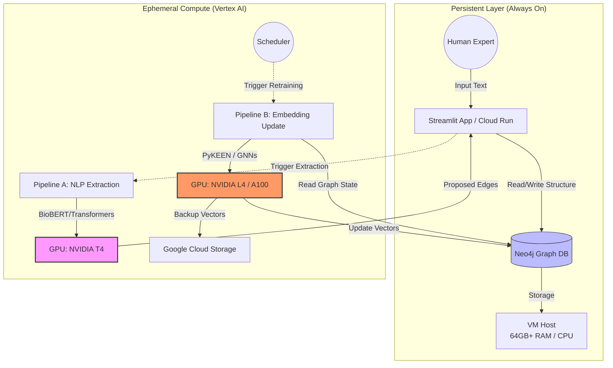

# PrimeKG Human-in-the-Loop Integration Architecture

This document outlines the infrastructure required to integrate human input (unstructured text) into the PrimeKG knowledge graph. The architecture solves two core challenges: translating natural language into structured graph elements and mathematically integrating new data into vector space (embeddings).

---

## 1. Logical Data Flow & Computational Requirements

### Stage 1: Human Input Processing (NLP)

**The Challenge:** Converting unstructured clinical sentences (e.g., *"Drug X appears to reduce symptoms of Disease Y but increases risk of Z"*) into structured nodes and edges compatible with PrimeKG.

**The Pipeline:**

1. **Named Entity Recognition (NER):** Identification of chemical structures ("Drug X") and phenotypes ("Disease Y").
2. **Relation Extraction (RE):** Semantic understanding of edge types ("reduces symptoms", "increases risk").
3. **Entity Linking (Normalization):** The critical step. Mapping "Drug X" to an existing unique identifier (e.g., `DB00123`) by comparing semantic meaning against the existing database.

**Hardware Justification (GPU):**

* **CPU Limitation:** Processing a single sentence with BioBERT takes ~0.5–1.0s. High-volume input makes this unfeasible.
* **GPU Acceleration (NVIDIA T4):** Parallel processing capability allows for dozens or hundreds of sentences per second using Transformer models (BioBERT, PubMedBERT, Clinical LLMs).

### Stage 2: Mathematical Integration (Embedding Retraining)

**The Challenge:** PrimeKG is utilized via vector space representations. Every node (drug/protein/disease) is a high-dimensional vector. Adding new knowledge changes the geometry of the graph.

* *Example:* If "Drug A" cures "Disease B", their vectors must move closer in the vector space. This shift propagates, affecting the neighbors of both nodes.

**The Solution:**

* Full graph embedding retraining (or incremental updates) using libraries like **PyKEEN** or **DGL**.
* Algorithms: TransE, RotatE, or Graph Neural Networks (GNNs).

**Hardware Justification (GPU):**

* **Scale:** PrimeKG contains millions of edges. Retraining involves billions of matrix operations.
* **Benchmark:** CPU training takes days/weeks. High-end GPUs (L4/A100) reduce this to hours or minutes.

---

## 2. Infrastructure Architecture (Google Cloud Platform)

The architecture is designed for cost-efficiency: lightweight resources for the interface and heavy, ephemeral resources for computation.

### A. The "Always-On" Layer (Interface & Storage)

* **Compute:** Low-cost VM or Cloud Run.
* **Components:**
* **Web Interface (Streamlit):** For human input and validation of NLP proposals.
* **Graph Database (Neo4j):** Stored on a VM with high RAM (64GB+). Handles the "live" graph structure and simple queries. CPU is sufficient here.

### B. The "On-Demand" Layer (Vertex AI)

Heavy compute is provisioned only when triggered.

1. **Pipeline A: Extraction (Frequent/Triggered)**
* **Trigger:** Human submits text.
* **Hardware:** **NVIDIA T4 (16GB VRAM)**.
* **Action:** Runs BioBERT for NER/RE/Linking. Proposes structure.
* **Duration:** Seconds/Minutes.

2. **Pipeline B: Mathematical Integration (Periodic)**
* **Trigger:** Scheduled (weekly) or threshold-based (data accumulation).
* **Hardware:** **NVIDIA L4 or A100**.
* **Action:** Loads full graph, retrains embeddings, updates vector space.
* **Duration:** Hours.

---

## 3. Visual Architecture

---

## 4. Production Stack & Workflow

To maintain a professional lifecycle, the implementation follows this stack:

### Containerization

* **`Dockerfile.app`:** Lightweight container for the API/Interface (Python/Streamlit).
* **`Dockerfile.train`:** Heavy container with CUDA drivers, PyTorch, PyKEEN/DGL for training jobs.

### Registry

* **Google Artifact Registry:** Secure storage for private Docker images.

### Orchestration Workflow

1. **Human Interaction:** Expert uses the App (Cloud Run).
2. **Data Persistence:** App commits structural changes to Neo4j.
3. **Batch Processing:**
* A scheduled script triggers a Vertex AI Custom Job.
* Vertex AI pulls the `train` image.
* Script loads graph data from Neo4j into memory (requires high RAM host).
* GPU executes the mathematical retraining.
* Updated vectors are written back to Neo4j and backed up to GCS.

### Hardware Summary

| Component | Recommendation | Function |
| --- | --- | --- |
| **Minimum GPU** | **NVIDIA T4 (16GB VRAM)** | NLP inference, light retraining. Cost-effective. |
| **Ideal GPU** | **NVIDIA L4 or A100** | Heavy graph embedding retraining at speed. |
| **System RAM** | **64GB+** | Crucial for loading the full PrimeKG graph into memory before GPU transfer. |